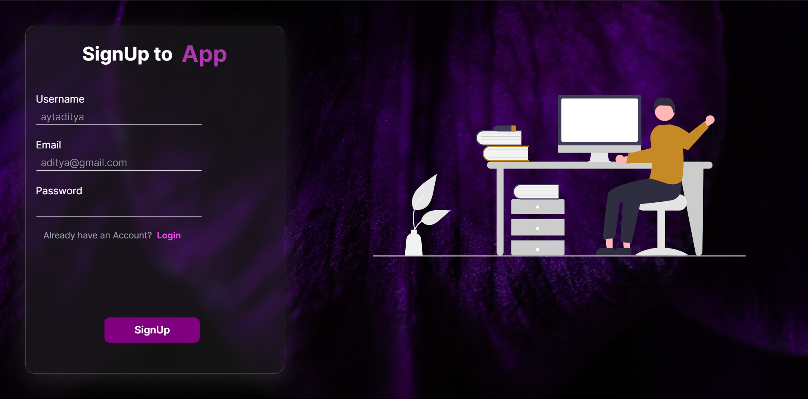

## A Next.js Application

This document outlines the features, tech stack, prerequisites, installation steps, and development server setup for a Next.js application.

## Features

* **Server-side Rendering & Static Site Generation:** Leverages Next.js for optimal performance and SEO benefits.
* **Modern & Responsive Styling:** Employs Tailwind CSS for a clean and adaptable design.
* **Data Storage:** Utilizes MongoDB for data persistence.
* **HTTP Requests:** Makes use of Axios for efficient HTTP communication.
* **Email-based Authentication:** Implements Nodemailer and Mailtrap for secure user login.
* **Magic Link Authentication:** Provides a convenient login flow using magic links.




## Tech Stack

* **Frontend:** Next.js, Tailwind CSS
* **Backend:** Next.js, MongoDB
* **Authentication:** Nodemailer, Mailtrap, jsonwebtoken
* **HTTP Client:** Axios

**Note:** An image (./app.png) is referenced in the original document, but it's not included here due to markdown limitations.

## Prerequisites

Ensure you have the following installed on your development machine:

* [Node.js](https://nodejs.org/en)
* [npm (bundled with Node.js) or yarn (a package manager)](https://yarnpkg.com/)
* [MongoDB](https://www.mongodb.com/try/download/community)

## Installation

Here's a breakdown of the installation steps:

1. **Clone the Repository**

   ```bash
   git clone https://github.com/your-username/your-repo-name.git
   ```

2. **Navigate to Project Directory**

   ```bash
   cd your-repo-name
   ```

3. **Install Dependencies**

   Use either npm or yarn to install the required packages. Here's an example using npm:

   ```bash
   npm install
   ```

   Alternatively, you can use yarn:

   ```bash
   yarn install
   ```

4. **Set Up Environment Variables**

   Create a file named `.env.local` in your project's root directory. Add the following environment variables, replacing the placeholders with your actual values:

   ```
   MONGODB_URI=your_mongodb_uri
   MAILTRAP_USER=your_mailtrap_username
   MAILTRAP_PASS=your_mailtrap_password
   NEXT_PUBLIC_SITE_URL=your_site_url
   ```

5. **Start the Development Server**

   Run the development server using npm or yarn. Here's the command for npm:

   ```bash
   npm run dev
   ```

   The equivalent command for yarn is:

   ```bash
   yarn dev
   ```

6. **Open the Application**

   Open your web browser and navigate to `http://localhost:3000` to view the application running.

This markdown code maintains the consistent code block formatting for installation steps, making it easier to follow the instructions. 